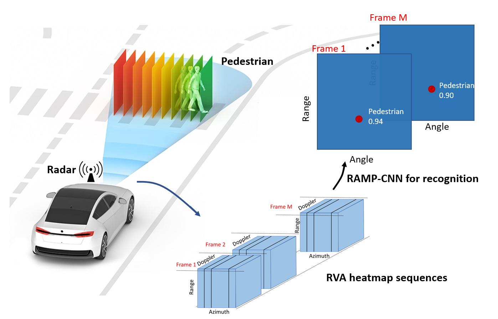
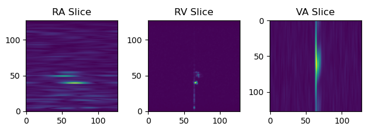

# Radar_multiple_perspective_object_detection

Automotive Radar Object Recognition Using Range-Velocity-Angle (RVA) Heatmap Sequences

<p align="center">  </p>

> [**RAMP-CNN: A Novel Neural Network for Enhanced Automotive Radar Object Recognition**](https://arxiv.org/pdf/2011.08981.pdf),            
> Xiangyu Gao, Guanbin Xing, Sumit Roy, and Hui Liu
> *arXiv technical report ([arXiv 2006.11275](https://arxiv.org/abs/2011.08981))*  

    @ARTICLE{9249018,  author={Gao, Xiangyu and Xing, Guanbin and Roy, Sumit and Liu, Hui},  
        journal={IEEE Sensors Journal},   
        title={RAMP-CNN: A Novel Neural Network for Enhanced Automotive Radar Object Recognition},   
        year={2021},  volume={21},  number={4},  pages={5119-5132},  doi={10.1109/JSEN.2020.3036047}}

## Contact
Any questions or suggestions are welcome! 

Xiangyu Gao [xygao@uw.edu](mailto:xygao@uw.edu) 

## Abstract
Millimeter-wave radars are being increasingly integrated into commercial vehicles to support new advanced driver-assistance systems by enabling robust and high-performance object detection, localization, as well as recognition - a key component of new environmental perception.
In this paper, we propose a novel radar multiple-perspectives convolutional neural network (RAMP-CNN) that extracts location and class of objects based on further processing of the rangevelocity-angle (RVA) heatmap sequences. To bypass the complexity of 4D convolutional neural networks, we propose to combine several lower-dimension NN models within our RAMP-CNN model that nonetheless approaches the performance upperbound with lower complexity. The extensive experiments show that the proposed RAMP-CNN model achieves better average recall and average precision than prior works in all testing scenarios. Besides, the RAMP-CNN model is validated to work robustly under the nighttime, which enables low-cost radars as a potential substitute for pure optical sensing under severe conditions.

## Use RAMP-CNN

Please find all radar configurations and algorithm configurations are included in [config](config.py).

### Software Requirement and Installation

Python 3.6, pytorch-1.5.1 (please refer to [INSTALL](requirements.txt) to set up libraries.)

### Download Sample Data and Model
1. From below Google Drive link
    ```
    https://drive.google.com/drive/folders/1TGW6BHi5EZsSCtTsJuwYIQVaIWjl8CLY?usp=sharing
    ```

2. Decompress the downloaded files and relocate them as following directory manners:
    ```
    './template_files/slice_sample_data'
    './template_files/train_test_data'
    './results/C3D-20200904-001923'
    ```

## 3D Slicing of Range-Velocity-Angle Data
For convenience, in the sample codes we use the [Range FFT result](https://github.com/Xiangyu-Gao/mmWave-radar-signal-processing-and-microDoppler-classification) as input and perform the Velocity and Angle FFT during the process of slicing. Run following codes for 3D slicing.
    
    python slice3d.py
    

The slicing resulsts are the RA slices, RV slices, and VA slices as shown in below figure.
<p align="center">  </p>

## Radar Data Augmentation
    To be continue ..

## Train and Test
1. Download sample data and model from the Google Drive with below link:
    Note that we select part of our training and testing set for your use here and the provided model was trainied with whole complete training set. You may use below slicing algorithm with 3DFFT data to create your own training and testing set.
2. 

3. Prepare the input data (RA, RV, and VA slices) and ground truth confidence map for training and testing:
    ```
    python prepare_data.py -m train -dd './data/'
    python prepare_data.py -m test -dd './data/'
    ```
4. Run training:
    ```
    python train_dop.py -m C3D
    ```
    You will get training as below
    ```
    No data augmentation
    Number of sequences to train: 1
    Training files length: 111
    Window size: 16
    Number of epoches: 100
    Batch size: 3
    Number of iterations in each epoch: 37
    Cyclic learning rate
    epoch 1, iter 1: loss: 8441.85839844 | load time: 0.0571 | backward time: 3.1147
    epoch 1, iter 2: loss: 8551.98437500 | load time: 0.0509 | backward time: 2.9038
    epoch 1, iter 3: loss: 8019.63525391 | load time: 0.0531 | backward time: 2.9171
    epoch 1, iter 4: loss: 8376.16015625 | load time: 0.0518 | backward time: 2.9146
    ```
5. Run testing:
    ```
    python test.py -m C3D -md C3D-20200904-001923
    ```
6. Run evaluate:
    ```
    python evaluate.py -md C3D-20200904-001923
    ```

## License

RAMP-CNN is release under MIT license (see [LICENSE](LICENSE)).

## Acknowlegement
This project is not possible without multiple great opensourced codebases. We list some notable examples below.  

* [microDoppler](https://github.com/Xiangyu-Gao/mmWave-radar-signal-processing-and-microDoppler-classification)