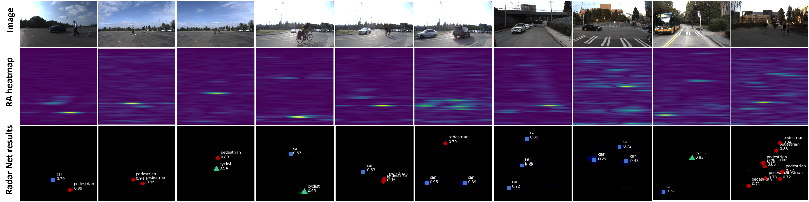
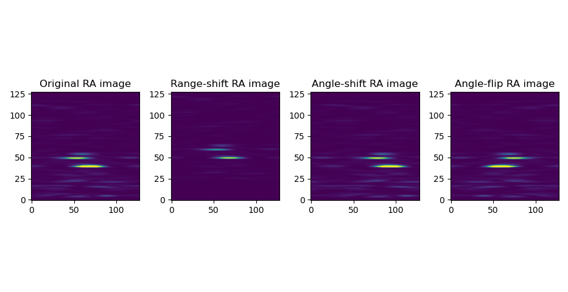

# Radar Multiple Perspective Object Detection

Automotive Radar Object Recognition in the Bird-eye View Using Range-Velocity-Angle (RVA) Heatmap Sequences

<p align="center">  </p>

> [**RAMP-CNN: A Novel Neural Network for Enhanced Automotive Radar Object Recognition**](https://arxiv.org/pdf/2011.08981.pdf),            
> Xiangyu Gao, Guanbin Xing, Sumit Roy, and Hui Liu
> *arXiv technical report* ([arXiv 2011.08981](https://arxiv.org/abs/2011.08981))  

    @ARTICLE{9249018,  author={Gao, Xiangyu and Xing, Guanbin and Roy, Sumit and Liu, Hui},  
        journal={IEEE Sensors Journal},   
        title={RAMP-CNN: A Novel Neural Network for Enhanced Automotive Radar Object Recognition},   
        year={2021},  volume={21},  number={4},  pages={5119-5132},  doi={10.1109/JSEN.2020.3036047}}

## Important Updates
***(Sep. 12, 2023) We updated the [instruction](./docs/UseUWCR.md) for converting the radar ADC data from [UWCR dataset](https://github.com/Xiangyu-Gao/Raw_ADC_radar_dataset_for_automotive_object_detection) to the training/testing data format used in this repo.***

***(June 17, 2022) The input data for slice3d.py script has been changed to the raw ADC data now [slice_sample_data](https://drive.google.com/drive/folders/1TGW6BHi5EZsSCtTsJuwYIQVaIWjl8CLY?usp=sharing).***

***(June 2, 2023) We provided an [instruction](./docs/UseUWCR.md) for converting the annotations from [UWCR dataset](https://github.com/Xiangyu-Gao/Raw_ADC_radar_dataset_for_automotive_object_detection) format to our format in [convert_annotations.py](./utils/convert_annotations.py).***

## Contact
Any questions or suggestions are welcome! 

Xiangyu Gao [xygao@uw.edu](mailto:xygao@uw.edu) 

## Abstract
Millimeter-wave radars are being increasingly integrated into commercial vehicles to support new advanced driver-assistance systems by enabling robust and high-performance object detection, localization, as well as recognition - a key component of new environmental perception. In this paper, we propose a novel radar multiple-perspectives convolutional neural network (RAMP-CNN) that extracts location and class of objects based on further processing of the rangevelocity-angle (RVA) heatmap sequences. To bypass the complexity of 4D convolutional neural networks, we propose to combine several lower-dimension NN models within our RAMP-CNN model that nonetheless approaches the performance upperbound with lower complexity. The extensive experiments show that the proposed RAMP-CNN model achieves better average recall and average precision than prior works in all testing scenarios. Besides, the RAMP-CNN model is validated to work robustly under the nighttime, which enables low-cost radars as a potential substitute for pure optical sensing under severe conditions.

## Highlights
<p align="center">  </p>

## Use RAMP-CNN

All radar configurations and algorithm configurations are included in [config](config.py).

### Software Requirement and Installation

Python 3.6, pytorch-1.5.1 (please refer to [INSTALL](requirements.txt) to set up libraries.)
Linux system (Preferred). If using Windows, please update the Linux-format paths in scripts, e.g., '/'->'\' or '\\'

### Download Sample Data and Model
1. From the below Google Drive link
    ```
    https://drive.google.com/drive/folders/1TGW6BHi5EZsSCtTsJuwYIQVaIWjl8CLY?usp=sharing
    ```

2. Decompress the downloaded files and relocate them as following directory manners:
    ```
    './template_files/slice_sample_data'
    './template_files/train_test_data'
    './results/C3D-20200904-001923'
    ```

## 3D Slicing of Range-Velocity-Angle Data
For convenience, in the sample codes we use the raw ADC data of each frame as input and perform the [Range, Velocity, and Angle FFT](https://github.com/Xiangyu-Gao/mmWave-radar-signal-processing-and-microDoppler-classification) during the process of slicing. Run following codes for 3D slicing.
    
    python slice3d.py
    

The slicing results are the RA slices, RV slices, and VA slices as shown in below figure.
<p align="center">  </p>

## Train and Test
1. Prepare the input data (RA, RV, and VA slices) and ground truth confidence map for training and testing. Note that the provided training and testing data is in the post-3D slicing format, so you can skip the last step if you used provided data here:
    ```
    python prepare_data.py -m train -dd './data/'
    python prepare_data.py -m test -dd './data/'
    ```
2. Run training:
    ```
    python train_dop.py -m C3D
    ```
    You will get training outputs as follows:
    ```
    No data augmentation
    Number of sequences to train: 1
    Training files length: 111
    Window size: 16
    Number of epoches: 100
    Batch size: 3
    Number of iterations in each epoch: 37
    Cyclic learning rate
    epoch 1, iter 1: loss: 8441.85839844 | load time: 0.0571 | backward time: 3.1147
    epoch 1, iter 2: loss: 8551.98437500 | load time: 0.0509 | backward time: 2.9038
    epoch 1, iter 3: loss: 8019.63525391 | load time: 0.0531 | backward time: 2.9171
    epoch 1, iter 4: loss: 8376.16015625 | load time: 0.0518 | backward time: 2.9146
    ...
    ```
3. Run testing:
    ```
    python test.py -m C3D -md C3D-20200904-001923
    ```
    You will get testing outputs as follows:
    ```
   rodnet_21_0000087601_000001.pkl
   ['2019_05_28_pm2s012']
   2019_05_28_pm2s012
   Length of testing data: 111
   loading time: 0.02
   finished ra normalization
   finished v normalization
   Testing 2019_05_28_pm2s012/000000-000016... (0)
   2019_05_28_pm2s012/0000000000.jpg inference finished in 0.6613 seconds.
   processing time: 3.69
   loading time: 0.02
   finished ra normalization
   finished v normalization
   Testing 2019_05_28_pm2s012/000008-000024... (0)
   2019_05_28_pm2s012/0000000008.jpg inference finished in 0.5039 seconds.
    ...
    ```
4. Run evaluation:
    ```
    python evaluate.py -md C3D-20200904-001923
    ```
    You will get evaluation outputs as follows:
    ```
    true seq
   ./results/C3D-20200904-001923/2019_05_28_pm2s012/rod_res.txt
    Average Precision  (AP) @[ OLS=0.50:0.90 ] = 0.9126
    Average Recall     (AR) @[ OLS=0.50:0.90 ] = 0.9653
   pedestrian: 1913 dets, 1792 gts
    Average Precision  (AP) @[ OLS=0.50:0.90 ] = 0.9126
    Average Precision  (AP) @[ OLS=0.50      ] = 0.9713
    Average Precision  (AP) @[ OLS=0.60      ] = 0.9713
    Average Precision  (AP) @[ OLS=0.70      ] = 0.9489
    Average Precision  (AP) @[ OLS=0.80      ] = 0.9062
    Average Precision  (AP) @[ OLS=0.90      ] = 0.7053
    Average Recall     (AR) @[ OLS=0.50:0.90 ] = 0.9653
    Average Recall     (AR) @[ OLS=0.50      ] = 0.9994
    Average Recall     (AR) @[ OLS=0.75      ] = 0.9821
    ...
    ```

## Radar Data Augmentation
Run below codes to check the results of 3 proposed data augmentation algorithms: flip, range-translation, and angle-translation.

    python data_aug.py

Below figure shows the performance of doing 10-bins range-translation (move upword), 25-degrees angle-translation (move rightword), and angle flip on original RA images. You may use this codes to develop your radar data augmentation and even generate new datas. 
<p align="center">  </p>

## Use the UWCR Dataset
If you want to explore more radar raw data in the [UWCR dataset](https://github.com/Xiangyu-Gao/Raw_ADC_radar_dataset_for_automotive_object_detection), it is necessary to make the data/annotation format conversion since the sample data and labels used this repository have different structures from that in the UWCR dataset.

Please refer to the instruction [UseUWCR](./docs/UseUWCR.md) for the annotation format conversion and training/testing data conversion.

## License

RAMP-CNN is release under MIT license (see [LICENSE](LICENSE)).

## Acknowlegement
This project is not possible without multiple great opensourced codebase and dataset. We list some notable examples below.  

* [microDoppler](https://github.com/Xiangyu-Gao/mmWave-radar-signal-processing-and-microDoppler-classification)
* [rodnet](https://github.com/yizhou-wang/RODNet)
* [raw_ADC_radar_dataset_for_automotive_object_detection](https://github.com/Xiangyu-Gao/Raw_ADC_radar_dataset_for_automotive_object_detection)
* [raw_2D_MIMO_radar_dataset_for_carry_object_detection](https://github.com/Xiangyu-Gao/Raw_2D_MIMO_radar_dataset_for_carry_object_detection)
